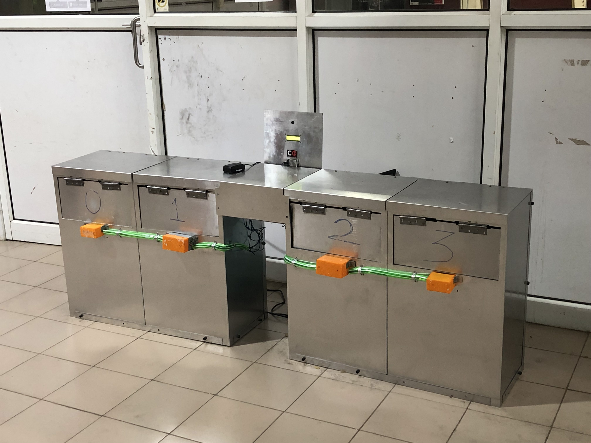

# Smart waste-segregator bin

## Problem
[IITM](https://www.iitm.ac.in/) is a residential institute where there is a **gigantic amount of waste** that is generated everyday with about three-fourth coming from the hostel and academic zone. A significant proportion of this waste that is **recyclable** in nature, unfortunately ends up in the landfill due to the **inefficiency in primary source segregation**.
1. The thousands of kilograms of unsorted waste **increases the carbon dioxide** released into the atmosphere, while raising the cost of segregation multifold. 
2. The **intermixing** up of recyclables with wet waste rendering them inseparable defeats any attempt at recycling. 
3. The process of employed for collecting, and segregation of the waste is completely manual. This is neither very efficient nor cost effective. The **health hazard** this entails, makes this labour intensive process dangerous. 
4. It is true that a small **change in the culture** of waste disposal - primary  segregation at source - can immensely ease this process. There is an immediate need to shift to a process that is simple and safe for both the people and the environment. 
 

## Proposed solution
A smart bin was made which **incentivizes recycling**. The various stages of use are detailed:
1. The bin consists of a 4x1 grid of **four** compartments. Each compartment is covered by a **flap** which cannot be opened manually. This helps keep the bin monkey proof, which is a perennial problem in IIT M. 
2. The bin, initially in an idle state is woken up by the user scanning his institute ID card. Thus, the identity of the user is recorded by the bin.
3. A camera scans the waste to determine which category it belongs to. After consultation with IIT M’s waste management body Owzone, the **categories for segregation** are designated as a) Plastic b) Paper c) Composites d) Wet Waste
4. With the aim of building a scalable smart bin which can adapt to changing standards in waste categories and increasingly compound modern materials, we utilised deep learning on an array of visual, capacitive and inductive sensors to achieve object detection and classification. We leveraged state of the art architectures in convolutional neural networks (CNNs) to represent over 1 billion distinct objects over **19 million object classes** and achieve **∼95%** accuracy.
5. Utilising  electrical sensors ensured stability of predictions. In order to facilitate usage of deep learning models on single board computers, we optimise both our models (quantisation, tensorrt) as well as compile **tflite** for our board (Raspberry Pi Zero, ASUS tinker board/BeagleBone board).
6. After the appropriate waste category is detected, the flap corresponding to that compartment **opens**. The user then drops the waste into the given compartment. The flap then shuts. 
7. The **electronics-subsystem** with servos control bin lids, RFID scanners to scan IDs, BeagleBone AI board to run DL models at edge, LCD to display bin no. and SMPS is used for power management.
7. This entire process (steps 1-7) takes less than **1 second**.
8. Based on the category of waste and the size of it, a **proportionate number of points** are credited to the  users account. These credits can later be used as mess -credits/ to redeem t-shirts.
9. If the bin is full, it sends an automated message requesting that it be emptied.

It is hoped that this system will help educate the students of IITM about appropriate recycling and segregation standards, making them more responsible citizens in the long run, making them work for a sustainable future. This project was field-tested in IITM Campus-Cafe and won the Silver Medal at Inter-IIT Tech Meet, Mumbai’18.

## Using the code
###Arduino (Mega)
1. `Arduino/v_2.0.0.ino` has a **FSM** (Finite State Machine) which scans RFID, changes display in LCD/dot-matrix display, generates PWM signals for motor control to open/close the lid, etc. as detailed in the 9 steps above, after receiving a signal from the computer performing waste classification.
2. `Modules` contains driver-codes for **peripherals** like RFID, servo, LCD display, etc.

###RPi/AI-boards (SBC - Single Board Computer)
1. **InceptionV3** and **ResNet512** models were trained with huge parallelism (on-premise GPU cluster) on a very large dataset (over **19 million object classes**) and the final trained model is stored in `models/model/garbagsse2.model`.
2. `models/classifier.py` is the **main script** that runs in the SBC, which invokes the saved model to perform waste classification, and then informs the same to Arduino using **GPIO ports** for further control dynamics.

## Additional resources
1. [Slides](https://drive.google.com/drive/folders/1dT3ZZ_8g_MOizgmEKLXDApM6tMJDBB5u?usp=sharing)
2. [Video](https://drive.google.com/file/d/1eWksJXGUBuACYEtR6RTmr3X5HRkNl-WT/view?usp=sharing)
3. [Code](https://github.com/sundar7D0/smart-bin)
